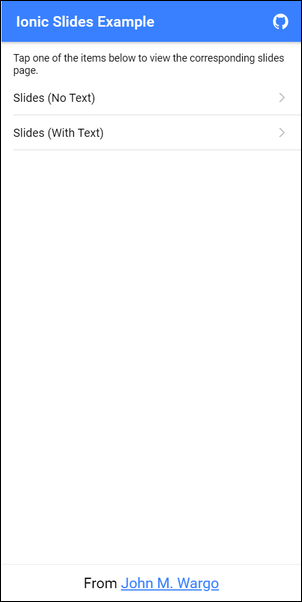

# Ionic Slides Example

When I first used Ionic Slides (https://ionicframework.com/docs/api/slides) I couldn't find any complete examples I could use as a starting point for my application. Josh Morony's [Building Mobile Apps with Ionic & Angular](https://www.joshmorony.com/building-mobile-apps-with-ionic-2) book introduced me to the topic, but didn't give me the playground I needed to tweak the slides example to better understand how to get text and images to work on the same slide, how to scale slide images to fit the screen, and more.

With that in mind, I decided to craft my own example nd make it available for others interested in learning how to add slides to their Ionic applications (in two different configurations).

**Note:** The screenshots used in this example app are from my [Time Slicer](https://timeslicer.app) app; this was the first app of my own that I used Ionic Slides for, so that's where I learned how to do this.

To use this sample:

1. Make sure you have [git](https://git-scm.com/) and [node.js](https://nodejs.org/en/) installed on your system
2. Open a terminal window or command prompt
3. Execute the following command:

```shell
git clone https://github.com/johnwargo/ionic-slides-example
```

This will copy the source code from GitHub (where I work) to a folder called `ionic-slides-example`. Next, execute the following commands:

```shell
cd ionic-slides-example
npm install
```

Assuming you have the [Ionic CLI](https://ionicframework.com/getting-started) installed, execute the following command:

```shell
ionic serve
```

Your default browser will open then display the following page:



Play around with the two slides options to see how the app works.

I did two slides implementations in this app because so many examples show Ionic Slides only using images, no text. Since the way you implement them are different, I decided to include both.

## Slides Without Text

Implementing `ion-slides` without text is easy, wrap each image with an `<ion-slide>` and you're good:

```HTML
<ion-slides pager="true">
    <ion-slide>
      <ion-img class="screenshot" src="assets/intro-01.png"></ion-img>
    </ion-slide>

    <ion-slide>
      <ion-img class="screenshot" src="assets/intro-02.png"></ion-img>
    </ion-slide>

    <ion-slide>
      <ion-img class="screenshot" src="assets/intro-03.png"></ion-img>
    </ion-slide>

    <ion-slide>
      <ion-img class="screenshot" src="assets/intro-04.png"></ion-img>
    </ion-slide>

    <ion-slide>
        <ion-img class="screenshot" src="assets/intro-05.png"></ion-img>
    </ion-slide>
</ion-slides>
```

However, once you add additional 'stuff' to the page, the extra stuff stops aligning properly. To fix this, I found that I had to a grid with rows and columns. The last slide in the series, the one that has the Home button on it, looks like this:

```html
<ion-slide>
    <ion-grid>
        <ion-row>
          <ion-img class="screenshot" src="assets/intro-05.png"></ion-img>
        </ion-row>
        <ion-row>
          <ion-col>
            <ion-button color="primary" style="margin-top:20px;" (click)="goHome()">
              Go Home
            </ion-button>
          </ion-col>
        </ion-row>
    </ion-grid>
</ion-slide>
```

When I first implemented this, I noticed that the page indicator at the bottom of the page didn't align properly with the other content on the page (it overlapped the image). To solve this, I found a solution on [Stack Overflow](https://stackoverflow.com/questions/55566105/ion-slides-pagination-bullet-overlap-the-slides-content-ionic-4). I added the following code to the project's `global.scss` file and everything worked perfectly (well, more or less).

```css
.swiper-pagination {
    position: fixed;
    bottom: 0px;
    padding-bottom: 3px;
}
```

Styling the rest of the page was pretty easy. I set a background color for one of the pages using this:

```css
ion-slide {
    background-color: lightgrey;
}
```

When you test the app, notice how the whole page doesn't get the background color until you get to the last page in the slide show.  I'm sure I could fix this with a little CSS, but I'll leave that up to you - this sample app gives you a playground you can use to figure out all sorts of styling for the Slides.

I made sure the image sized correctly using the following CSS:

```css
ion-img {
    margin-left: auto;
    margin-right: auto;
    width: 75%;
    max-width: 800px;
    max-height: 60%;
}
```

And my Home button overlapped the pager component a bit, so I gave it a bottom margin using the following:

```css
ion-button {
    margin-bottom: 30px;
}
```

## Slides With Text

As I mentioned in the previous section, as soon as a Slide has more than just an image, layout of the slides components goes all wonky. I'm sure it was for good reason, but I'm not enough of a CSS expert to figure out the best way to make it all look the way I wanted. Instead, I used `<ion-grid>`, `<ion-row>`, and `<ion-col>` components to layout sections like I wanted. It all works pretty well - here's an example from one of the app's slides:


```html
<ion-slide>
    <ion-grid>
        <ion-row>
            <ion-col>
                <p>Time Slicer is like a <strong>Stopwatch</strong><br />with <strong>Categories</strong>.</p>
              </ion-col>
        </ion-row>
        <ion-row>
            <ion-col>
                <ion-img src="assets/intro-01.png"></ion-img>
            </ion-col>
        </ion-row>
    </ion-grid>
</ion-slide>
```

***

You can find information on many different topics on my [personal blog](http://www.johnwargo.com). Learn about all of my publications at [John Wargo Books](http://www.johnwargobooks.com).

If you find this code useful and feel like thanking me for providing it, please consider <a href="https://www.buymeacoffee.com/johnwargo" target="_blank">Buying Me a Coffee</a>, or making a purchase from [my Amazon Wish List](https://amzn.com/w/1WI6AAUKPT5P9).
